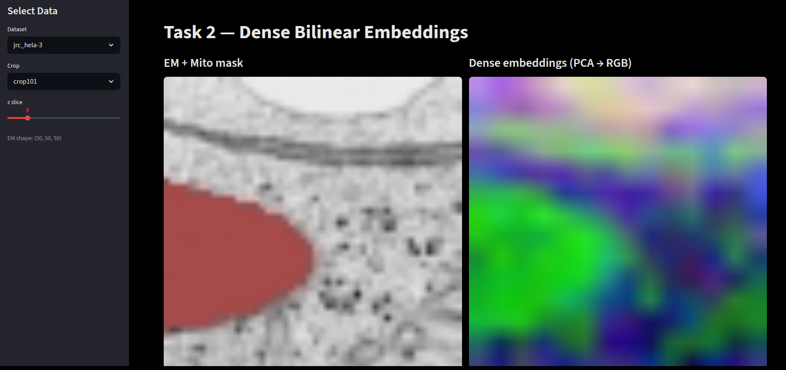
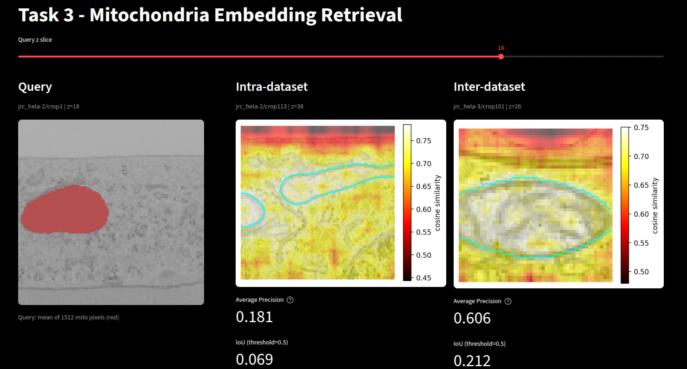

# MIA-AI Take-Home Challenge — Task 2

## Setup

```bash
pip install -r requirements.txt
```

Requires a CUDA-capable GPU (~1.4 GB VRAM for ViT-L, ~7 GB RAM after model load).


## Task 1 — Data Acquisition

[`download_datasets.py`](download_datasets.py) downloads EM image patches and mitochondria masks from the [OpenOrganelle](https://openorganelle.janelia.org) S3 bucket (public, anonymous access).

For each dataset, the script finds all annotated crops that contain actual mitochondria voxels and downloads:
- `em.npy` — raw EM image patch as `(Z, Y, X)` uint8
- `mito_mask.npy` — binary mitochondria mask aligned to the EM patch

### Output structure

```
data/
├── jrc_hela-2/
│   └── crop_X/
│       ├── em.npy
│       └── mito_mask.npy
└── jrc_hela-3/
    └── crop_X/
        ├── em.npy
        └── mito_mask.npy
```

Scale `s2` gives 16 nm/px in y/x and 12.96 nm/px in z — a good balance between structural detail and download size.

**Note on resolution mismatch:** mito labels at `s2` have 2× finer voxel size than EM in all dimensions. The download script converts physical nm offsets before computing EM voxel indices so the two arrays align correctly.

---

## Task 2 — Feature Extraction with DINO

[`extract_bilinear_embeddings.py`](extract_bilinear_embeddings.py) · [`utils/dinov3.py`](utils/dinov3.py)

**Model:** DINOv3 ViT-L/16 (`facebook/dinov3-vitl16-pretrain-lvd1689m`) via HuggingFace Transformers.

EM slices are greyscale — each slice is converted to RGB by repeating the single channel three times before passing to the processor.

### 1. Patch Size Selection

**Chosen patch size: 16 × 16 pixels.**

At scale `s2` each pixel is 16 nm, so one patch covers **256 nm × 256 nm** of real tissue. Mitochondria are 500 nm – 1 µm in diameter, so 2–4 patches fit across a single mitochondrion. This gives each patch enough context to capture meaningful local structure without mixing multiple organelles in a single token.

- Smaller patches (p8 = 128 nm): too little context per patch, loses structural information.
- Larger patches (p32 = 512 nm): larger than a single mitochondrion, mixes organelle content with surroundings.

DINOv3 natively uses p16, which aligns exactly with this reasoning.

### 2. Dense Per-Pixel Embeddings

ViT produces one token per patch — a 14 × 14 grid for 224 × 224 input. To obtain per-pixel embeddings, the 14 × 14 patch token grid is bilinearly interpolated back to the original image size.

```python
# patch_tokens: (1, 196, 1024) — skip CLS and register tokens
tokens = patch_tokens[0].reshape(1, 14, 14, 1024).permute(0, 3, 1, 2)
dense = F.interpolate(tokens, size=target_size, mode='bilinear', align_corners=False)
dense = dense.squeeze(0).permute(1, 2, 0)  # (H, W, 1024)
```

Bilinear interpolation is preferred over nearest-neighbour because it produces smooth transitions at patch boundaries rather than hard block artifacts, which matters when computing per-pixel cosine similarity.

The full dense volume is saved per crop:
-  `dense_embeddings.npy` — `(Z, H, W, 1024)` float16 per pixel


### Visualisation

[`visualize_embeddings.py`](visualize_embeddings.py) is a lightweight Streamlit dashboard that loads one z-slice at a time and shows the EM + mito overlay alongside the dense embeddings reduced to RGB via PCA. The PCA colour structure confirms the off-the-shelf DINO features are already semantically meaningful — mito regions cluster to a distinct colour with no training.

---

## Task 3 — Embedding-Based Retrieval & Visualization

[`dashboard.py`](dashboard.py) · [`utils/retrieval.py`](utils/retrieval.py)

Run `streamlit run dashboard.py`. Use the sidebar to select a query crop, an intra-dataset crop (same dataset, different crop), and an inter-dataset crop (different dataset). Click any pixel in the query panel — a similarity heat map appears for the other two panels instantly.

### 1. Within-Dataset Retrieval

After clicking a query pixel, cosine similarity is computed between its 256-dim projected embedding and every pixel embedding in the target crop. The result is overlaid as a heat map on the EM grayscale.

Within the same dataset, EM appearance is consistent — same microscope, same imaging conditions. The embeddings capture local visual patterns, so regions that look similar to the query pixel score high. This makes within-dataset retrieval generally reliable and produces clear, spatially coherent similarity maps.

### 2. Cross-Dataset Retrieval

The same query embedding is compared against embeddings from a crop in the other dataset. Because DINOv3 was pretrained on diverse images, its features generalise across acquisitions — mitochondria produce similar local patterns regardless of which dataset they come from.

Cross-dataset similarity scores are typically slightly lower than intra-dataset due to minor differences in imaging conditions between datasets, but the overall retrieval pattern holds — high-similarity regions still correspond to visually similar structures in the target crop.

### 3. Multiple Queries

With a single query pixel, retrieval reflects only that one location's appearance. Multiple queries allow broader coverage and reduce the effect of choosing an unrepresentative point. Three practical approaches:

- **Mean embedding** — average all query embeddings into one vector and run cosine similarity. Simple and robust when all queries are from visually similar regions.
- **Max similarity** — compute similarity separately per query, take element-wise maximum. Highlights anything similar to any of the queries — useful when queries cover different visual regions.
- **Cluster-then-query** — cluster the query embeddings, use each centroid as a separate query. Useful for understanding what distinct visual patterns exist in the query set.

With multiple queries the similarity maps tend to be broader and more complete, covering more of the target mitochondria. Cross-dataset retrieval benefits most since averaging across queries reduces sensitivity to any single point's embedding.

---

## Task 4 — Proposal: Improving Mitochondria Detection with Minimal Fine-Tuning

[`train_linear_probe.py`](train_linear_probe.py) · [`project_embeddings.py`](project_embeddings.py)

**Proposed approach: linear probing on a frozen DINOv3 backbone.**

Train a linear projection head (1024 → 256) plus a binary segmentation head (256 → 1) on top of a fully frozen DINOv3 ViT-L/16 backbone, using `BCEWithLogitsLoss` against the mito binary mask. Train across all crops from both datasets simultaneously so the projection generalises rather than overfitting to a single acquisition.

| Component | Parameters |
|-----------|-----------|
| DINOv3 ViT-L/16 backbone | 307 M (frozen) |
| Linear projection 1024 → 256 | 262,144 |
| Segmentation head 256 → 1 | 257 |
| **Total trainable** | **~262 K (0.08%)** |

DINOv3's self-supervised pretraining produces embeddings that already separate visually distinct regions. Mitochondria have a consistent appearance in EM that differs from surrounding structures, so a linear probe can learn to separate them with very few trainable parameters and minimal risk of overfitting.

The linear probe is trained on the pre-extracted embeddings — no DINOv3 forward pass during training. Run `project_embeddings.py` next to apply the projection to all crops.

Saved files:
- `data/projection.pt` — trained projection weights
- `mito_embeddings.npz` — projected embeddings per crop as `(Z, H, W, 256)` float16


---

## Screenshots

### Task 2 — Dense Embeddings (PCA → RGB)

Left: raw EM slice with mitochondria highlighted in red. Right: per-pixel DINOv3 embeddings reduced to RGB via PCA — mito regions cluster to a distinct colour with no training.



---

### Task 3 — Within-Dataset & Cross-Dataset Retrieval

Query pixel clicked inside a mitochondrion (left). Cosine similarity heat map overlaid on a crop from the same dataset (centre) and from the other dataset (right).



---

## Config

All parameters are centralised in `config.yaml`:

```yaml
S3_PATH: s3://janelia-cosem-datasets
DATASET_NAMES:
  - jrc_hela-2
  - jrc_hela-3
SCALE: s2
DATA_DIR: data
MODEL_NAME: facebook/dinov3-vitl16-pretrain-lvd1689m
EMBED_DIM: 1024
PROJ_DIM: 256
N_EPOCHS: 3
LR: 0.001
DISPLAY_SIZE: 400
```

---

## Running Order

Run the full pipeline with:

```bash
bash run.sh
```

This runs all steps in order, printing PID, GPU/VRAM usage, and log path after each step. Both Streamlit dashboards are launched at the end in parallel.

| Step | Script | Task |
|------|--------|------|
| 1 | [`download_datasets.py`](download_datasets.py) | Task 1 — download EM patches and mito masks |
| 2 | [`extract_bilinear_embeddings.py`](extract_bilinear_embeddings.py) | Task 2 — extract dense bilinear embeddings |
| 3 | [`train_linear_probe.py`](train_linear_probe.py) | Task 4 — train linear projection on frozen DINOv3 |
| 4 | [`project_embeddings.py`](project_embeddings.py) | Task 3/4 — project embeddings to 256-dim |
| 5 | [`visualize_embeddings.py`](visualize_embeddings.py) | Task 2 — visualise dense embeddings (PCA → RGB) |
| 6 | [`dashboard.py`](dashboard.py) | Task 3 — retrieval dashboard |
